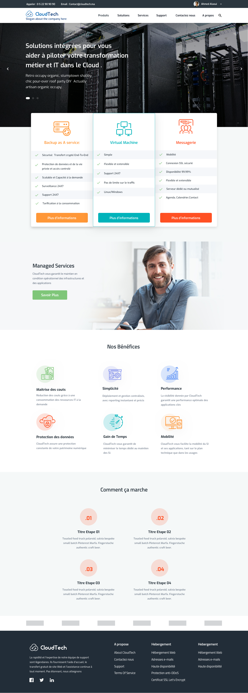

# CloudTech 

CloudTech - Slogan about the company here

## Demo

[Online-Demo]

## Tech

- HTML5 - HTML5 is a software solution stack that defines the properties and behaviors of web page content by implementing a markup-based pattern to it.
- CSS 3 & SASS - Cascading Style Sheets (CSS) — CSS with superpowers. Sass is the most mature, stable, and powerful professional grade CSS extension language in the world.
- JavaScript - JavaScript is the programming language of HTML and the Web.
- Ionicons - Ionicons is an open-sourced and MIT licensed icon pack.

## License

[MIT](https://choosealicense.com/licenses/mit/) © [ABDELAZIZ EL ARASSI](https://www.linkedin.com/in/aelarassi/)

[online-demo]: https://cloudtech-web.netlify.com/
